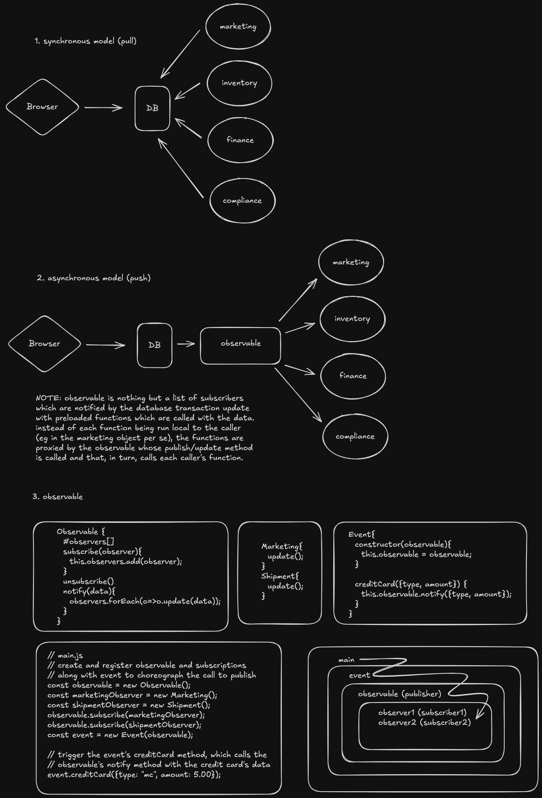

# JS Streams (node and web)

- [erick wendell course - mastering nodejs streams](https://masteringnodejsstreams.club.hotmart.com/t/page/E4zgW6b9el)

## Events

js has a list of events and functions that respond to them. all these events are put in a FIFO queue (EVENT QUEUE) and handled by the event loop which is continuous.

- [mdn events reference](https://developer.mozilla.org/en-US/docs/Web/Events)
- [nodejs events reference](https://nodejs.org/api/events.html)

## Observable - ecommerce project 1

